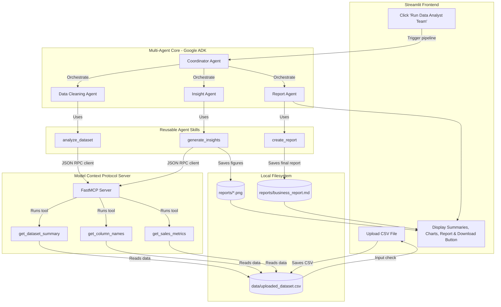

# AI Data Analyst Team for Small Businesses 📊

A practical, beginner-friendly **Multi-Agent AI System** built using the Google **Agent Development Kit (ADK)** and the **Model Context Protocol (MCP)**. This application enables small business owners to upload their sales transaction CSV files and receive automated data quality summaries, visualizations, deep business insights, and a downloadable executive report.

---

## 🏗️ Architecture Diagram

The system employs a collaborative four-agent workflow structured using ADK, which fetches dataset information strictly through local MCP tool calls.



---

## 🤖 Agent Roles

1.  **Coordinator Agent (`agents/coordinator_agent.py`)**: Receives the user request, starts the specialized agents sequentially, extracts output properties, and compiles them.
2.  **Data Cleaning Agent (`agents/cleaning_agent.py`)**: Detects missing cells, duplicates, and general schema, highlighting dataset sanitization needs.
3.  **Insight Agent (`agents/insight_agent.py`)**: Analyzes product and monthly revenues, saves line/bar chart visualizations, and generates business opportunities and risks.
4.  **Report Agent (`agents/report_agent.py`)**: Assembles everything into a formal markdown document and saves it to the filesystem.

---

## 🛠️ Reusable Agent Skills

*   **`analyze_dataset(file_path)`** (`skills/analyze_dataset.py`): Connects to the MCP server to retrieve basic metadata (shapes, rows, columns, duplicate records).
*   **`generate_insights(file_path)`** (`skills/generate_insights.py`): Triggers MCP server metric aggregations, saves visual charts, and compiles statistics.
*   **`create_report(clean_summary, insights_data, gemini_insights)`** (`skills/create_report.py`): Formats the findings into standard Markdown tables and text sections.

---

## 🚀 Setup & Local Execution

### Prerequisites
*   Python 3.10 or higher
*   A Gemini API Key (get one from [Google AI Studio](https://aistudio.google.com/))

### 1. Clone the repository and navigate to it:
```bash
git clone https://github.com/your-username/AI-Data-Analyst-Team.git
cd AI-Data-Analyst-Team
```

### 2. Install dependencies:
```bash
pip install -r requirements.txt
```

### 3. Configure your API key:
Create a `.env` file in the root directory:
```env
GEMINI_API_KEY=your_actual_gemini_api_key
```

### 4. Run the Streamlit application:
```bash
streamlit run app.py
```

Streamlit will launch locally in your browser (typically at `http://localhost:8501`). Upload `data/sample_sales.csv` to verify.

---

## ☁️ Streamlit Community Cloud Deployment Guide

To deploy this project to Streamlit Community Cloud:

### Step 1: Push Code to GitHub
Ensure your repository has the exact project structure:
```text
AI-Data-Analyst-Team/
├── app.py
├── requirements.txt
├── agents/
├── skills/
├── mcp_server/
└── data/
```
Make sure **NOT** to push your `.env` file (ensure it is listed in your `.gitignore` file).

### Step 2: Deploy on Streamlit Community Cloud
1.  Log in to [Streamlit Share](https://share.streamlit.io/) with your GitHub account.
2.  Click **New App**.
3.  Select your Repository, Branch (e.g. `main`), and Main file path (`app.py`).
4.  Expand the **Advanced settings** section.

### Step 3: Add API Keys to Streamlit Secrets
In the **Secrets** text area, paste your Gemini API Key in TOML format:
```toml
GEMINI_API_KEY = "AIzaSy..."
```
Streamlit will automatically set this secret as an environment variable in your cloud container.

### Step 4: Click Deploy!
Streamlit will provision a container, run `pip install -r requirements.txt`, configure your secrets, and launch your live application.

---


## 🔒 Security Features Implemented

*   **CSV-Only Constraint**: The Streamlit file uploader explicitly filters file formats using `type=["csv"]`.
*   **File Size Limit**: Checks uploaded file sizes, raising errors and rejecting files >10MB.
*   **Well-Formed Data Profiling**: Validates that critical column indices (Products, Sales/Prices) exist, preventing computation failures.
*   **Prompt Injection Protection**: System instructions for ADK agents enforce strict, closed analyst personas to prevent system instruction overrides.
*   **Safe Execution Backends**: Matplotlib is run using a non-interactive backend (`Agg`) to prevent GUI thread conflicts on web runtimes.
